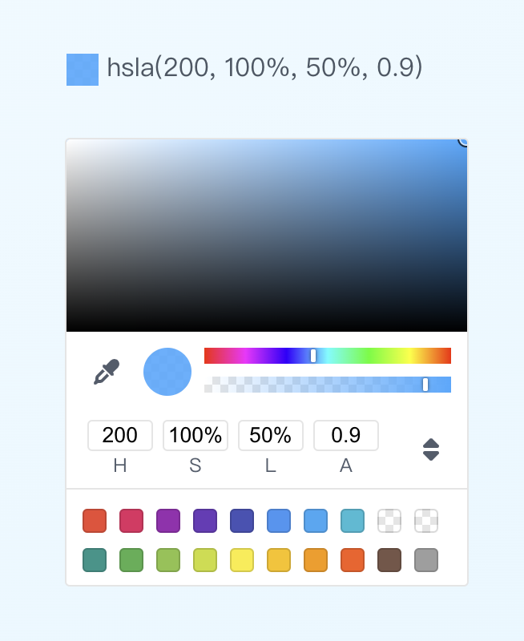

# React Color Picker

A color picker component for React.

[Live Demo](https://mengdu.github.io/react-data-viewer)

## Usage

```sh
npm install @lanyue/react-color-picker
```

```jsx
import { useState } from 'react'
import { ColorPicker } from '@lanyue/react-color-picker'
import '@lanyue/react-color-picker/dist/style.css'

export default function App() {
  const [color, setColor] = useState('hsla(200, 100%, 50%, 0.9)')
  const presets = [
    '#f44337', '#e91e63', '#9c27b0' , '#683ab8', '#3f52b5', '#2196F3', '#03A9F4', '#00BCD4', 'rgba(0, 0, 0, 0)', 'rgba(255, 255, 255, 0)',
    '#009688', '#4CAF50', '#8BC34A' , '#CDDC39', '#FFEB3B', '#FFC107', '#ff9800', '#ff5722', '#795548', '#9E9E9E'
  ]
  return (
    <>
      <div className="color-view">
        <div style={{background: `${color}`}}></div>
      </div>&nbsp;
      <span>{color}</span>

      <ColorPicker
        value={color}
        presets={presets}
        onChange={setColor}
        />
    </>
  )
}
```

**Preview**


